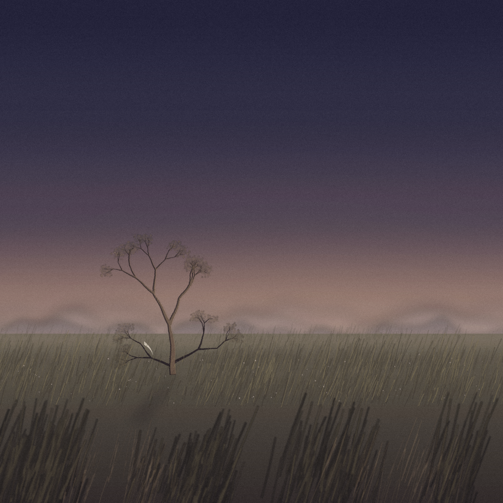

# Nazanin Maryam — Cover Artwork

A poetic, cinematic fine-art cover inspired by the emotional atmosphere of "Nazanin Maryam" — expressed entirely through landscape, with no figures, faces, or literal narrative.

## About

A vast Iranian countryside at the last moment of sunset: tall wild grass in the foreground, a single weathered old tree standing alone in the middle distance, and mountains dissolving into mist on the horizon. A small scrap of white fabric caught on a low branch is the only trace of someone once there.

The image is generated procedurally (sky gradient, mist, mountain silhouettes, a recursively-branched tree with sparse foliage, layered wind-bent grass, film grain, and color grading) rather than painted or photographed. The composition leaves generous open space in the upper two-thirds for a title to be placed later.

## Files

| File | Description |
|---|---|
| `nazanin-maryam-cover.png` | Final artwork, 3000×3000px |
| `nazanin-maryam-design-philosophy.md` | The visual design philosophy behind the piece |
| `naznin-maryam.py` | The Python script (PIL/NumPy) that generates the image |

## License

Feel free to use this script — modify it, extend it, repurpose it for other scenes, no attribution required.
